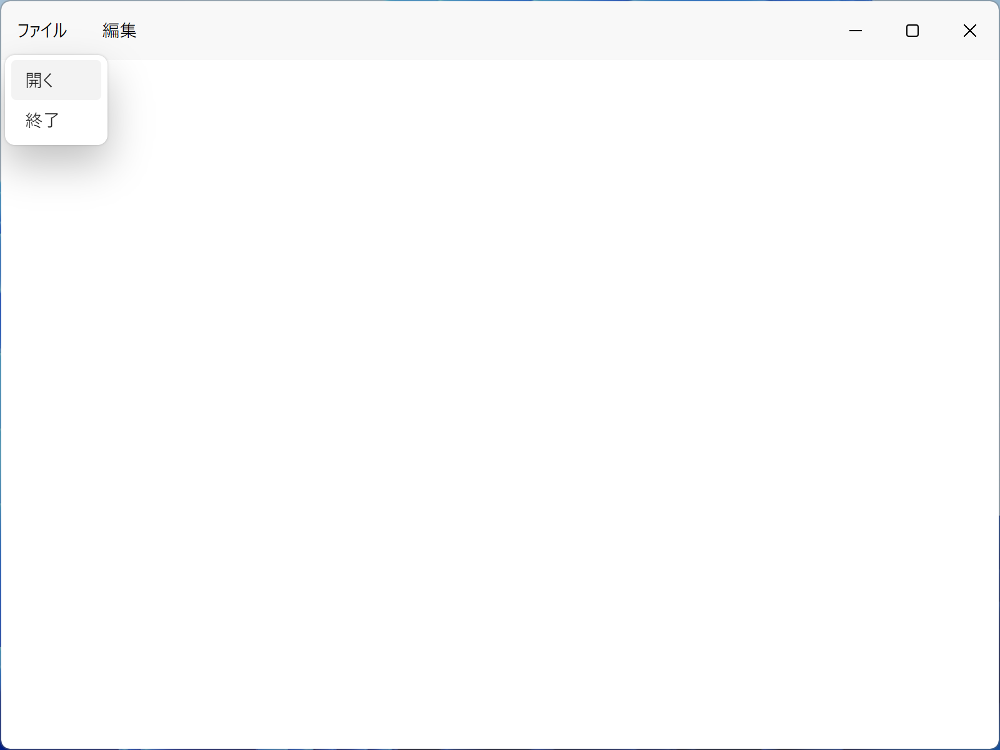

# sida
Fluent UI を使用した Electron アプリケーションの例です。



## 開発
当方の開発環境が Windows 11 のため、Windows 10/11 での開発を推奨します。

### 依存パッケージのインストール
package.json の devDependencies と dependencies のパッケージがインストールされます。

```sh
yarn install
```

### 実行
アプリが起動します。

開発者ツールに警告が出る場合もありますが、パッケージ化すると消える場合は無視して問題ありません。

```sh
yarn run start
```

### パッケージ化
パッケージが out\ に出力され、
out\sida-win32-x64\sida.exe を実行すると、アプリが起動します。

```sh
$env:TEMP="$env:LOCALAPPDATA\Temp" # RAM ディスク等で TEMP の場所が異なる場合
yarn run package
```

### インストーラー作成
インストーラーが out\make\ 下に作成される。

実行すると、アプリがインストールとアプリの実行が行われる。

```sh
yarn run make
```